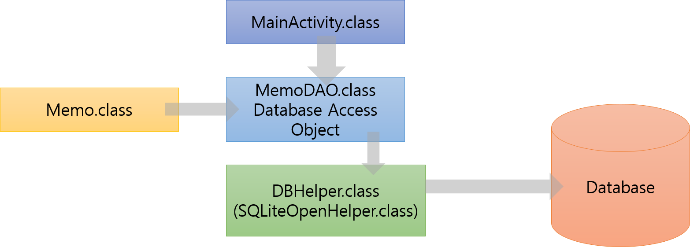

##### 공부한 내용

##### 1. SQLiteOpenHelper 클래스에 getReadableDatabase()와 getWritableDatabase() 함수는 return 하는데 오래걸리므로 main thread에서 사용하면 안된다.

##### 2. getReadableDatabase과 getWritableDatabase의 차이점은 무엇일까?

##### DB 연결 과정



##### 먼저 MainActivity에서 MemoDAO 클래스 객체 생성
```java
public class MainActivity extends AppCompatActivity {
  MemoDAO dao = null;
  @Override
    protected void onCreate(Bundle savedInstanceState) {
      ...
      dao = new MemoDAO(this);
    }
  }
  ```
##### MemoDAO 클래스 객체가 만들어지면 생성자에 있던 DBHelper 클래스 객체 만들어짐
```java
public class MemoDAO {
  DBHelper helper;
    public MemoDAO(Context context){
        helper = new DBHelper(context);
    }
  }
```
##### DBHelper 클래스 객체 만들어지면 super에서 넘겨받은 database가 생성되어있는지 확인한 후
> ##### 1. 없으면 onCreate 호출
> ##### 2. 있으면 버전을 체크해서 생성되어 있는 DB보다 버전이 높으면 onUpgrade() 호출

```java
public class DBHelper extends SQLiteOpenHelper {
  private static final String DB_NAME = "sqlite.db";
  private static final int DB_VERSION = 2;
  @Override
    public void onCreate(SQLiteDatabase sqLiteDatabase) {
      String createQuery = "CREATE TABLE `memo` ( `id` INTEGER PRIMARY KEY AUTOINCREMENT, " +
                "`title` TEXT, `content` TEXT, `n_date` TEXT )";
      sqLiteDatabase.execSQL(createQuery);
    }
  }
```

##### 즉 new MemoDAO 하면 new DBHelper가 되면서 데이터베이스에 연결이 되는 것 같음?? 이거 질문

##### MemoDAO에서 SQLiteDatabase 객체를 DBHelper객체의 getReadableDatabase 또는 getWritableDatabase로 생성함
##### 그리고 SQLiteDatabase 객체의 execSQL 메서드를 통해 query 읽어온 다음 SQLiteDatabase 객체를 닫는다.
```java
SQLiteDatabase connection = helper.getReadableDatabase();
connection.execSQL(query);
connection.close();
```

##### DB를 읽어올 때는 약간 다른데 DB를 읽어와 ArrayList에 저장한 후 화면에 뿌려준다. 이 때 Cursor 클래스를 이용하는데
##### Cursor 클래스는 DB의 data를 각 항목별로 저장을 하게 된다.
```java
public ArrayList<Memo> read(){
        String query = "select id, title, content, n_date from memo";
        ArrayList<Memo> list = new ArrayList<>();
        SQLiteDatabase connection = helper.getReadableDatabase();
        Cursor cursor = connection.rawQuery(query, null);
        while(cursor.moveToNext()){
            Memo memo = new Memo();
            memo.id = cursor.getInt(0);
            memo.title = cursor.getString(1);
            memo.content = cursor.getString(2);
            memo.n_date = cursor.getString(3);
            list.add(memo);
        }
        connection.close();
        return list;
    }
```
